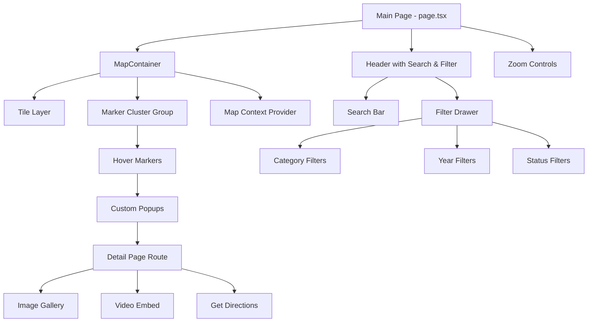

# P2M Interactive Map - Complete Documentation

> **Version:** 2.8.0  
> **Tech Stack:** Next.js 16, React 19, TypeScript 5, Tailwind CSS 4, Leaflet 1.9, driver.js  
> **Status:** 🚀 Deployed / Production (100% Core Features Complete + Onboarding)

---

## Table of Contents

1. [Project Overview](#1-project-overview)
2. [Architecture](#2-architecture)
3. [Features & Components](#3-features--components)
4. [UX Design Patterns](#4-ux-design-patterns)
5. [Development Roadmap](#5-development-roadmap)
6. [Accessibility](#6-accessibility)
7. [Performance](#7-performance)
8. [Testing](#8-testing)
9. [Data Pipeline](#9-data-pipeline)

---

## 1. Project Overview

### 1.1 Vision

Membangun platform pemetaan interaktif yang mampu memvisualisasikan **50+ program P2M (Pengabdian Kepada Masyarakat)** secara intuitif, informatif, dan menarik melalui pendekatan multimedia dan geolokasi yang accessible, performant, dan mobile-first.

### 1.2 Goals

- **Eksplorasi Geografis:** Mempermudah eksplorasi geografis program P2M dengan interface yang intuitif
- **Visualisasi Interaktif:** Mengubah data statis menjadi pengalaman visual interaktif yang engaging
- **Informasi Lengkap:** Menyediakan informasi lengkap dari overview → detail → multimedia
- **Aksesibilitas:** Memastikan aplikasi dapat digunakan oleh semua orang (WCAG 2.1 AA)
- **Performa Optimal:** Load time <2s pada 4G, smooth interactions di semua devices

### 1.3 Target Audience

| Tier | Description | Devices | Priority Features |
|------|-------------|---------|-------------------|
| **Primary** | Mahasiswa TRM (18–25) | Mobile-first | Search, Filter, Quick Info |
| **Secondary** | Dosen/Staff P2M | Desktop | Detailed Views, Data Management |
| **Tertiary** | Umum/Pemerhati | Mobile/Desktop | General Information, Sharing |

### 1.4 Core Principles

| Principle | Description | Implementation |
|-----------|-------------|----------------|
| **Clarity** | Information is immediately understandable | Clear typography, visual hierarchy, consistent icons |
| **Intuitive** | Interactions are natural and require minimal learning | Familiar patterns, progressive disclosure, helpful feedback |
| **Engaging** | Multimedia and smooth transitions maintain interest | Micro-animations (<200ms), rich media, hover states |
| **Performance** | Fast loading and seamless responsiveness | Lazy loading, code splitting, optimized images |
| **Accessible** | Usable by everyone, including assistive technology users | WCAG 2.1 AA, keyboard navigation, screen reader support |

---

## 2. Architecture

### 2.1 Tech Stack Rationale

#### Why Next.js 16?
- **App Router:** Better performance with React Server Components
- **Server Components:** Reduced bundle size, faster initial load
- **Built-in Optimization:** Image optimization, font optimization, code splitting
- **TypeScript Support:** First-class TypeScript integration

#### Why React 19?
- **Enhanced Context API:** Improved performance, reduced re-renders
- **Actions API:** Simplified asynchronous UI states
- **Concurrent Features:** Better user experience with transitions

#### Why Leaflet over Google Maps?
- **Lightweight:** 42KB vs 200KB+ (Google Maps)
- **Free & Open Source:** No API key required for basic usage
- **Highly Customizable:** Full control over markers, popups, styling
- **No Vendor Lock-in:** Can switch tile providers easily

#### Why react-leaflet?
- **Declarative:** React components instead of imperative API
- **Type Safety:** Full TypeScript support
- **React Integration:** Proper lifecycle management, hooks support
- **Community:** Active maintenance and ecosystem

### 2.2 Component Architecture



### 2.3 File Structure

```
interactive-map-app/
├── src/
│   ├── app/                      # Next.js App Router
│   │   ├── page.tsx             # Main page with state management
│   │   ├── layout.tsx           # Root layout
│   │   ├── globals.css          # Global styles + Leaflet overrides
│   │   └── program/[id]/
│   │       └── page.tsx         # Dynamic detail page
│   ├── components/
│   │   ├── ClientOnlyMap.tsx    # SSR wrapper for map
│   │   ├── Map.tsx              # Main map component
│   │   ├── HoverMarker.tsx      # Marker with hover behavior
│   │   ├── CustomPopup.tsx      # Popup content
│   │   ├── Header.tsx           # Search + filter trigger
│   │   ├── SearchBar.tsx        # Search input
│   │   ├── FilterMenu.tsx       # Filter checkboxes
│   │   └── ZoomControl.tsx      # Custom zoom buttons
│   ├── context/
│   │   └── MapContext.tsx       # Map instance context
│   ├── data/
│   │   └── programs.ts          # Static program data (temp)
│   └── hooks/
│       └── useDebounce.ts       # Debounce hook
├── public/                      # Static assets
├── package.json                 # Dependencies
├── tsconfig.json                # TypeScript config
├── tailwind.config.ts           # Tailwind config
└── next.config.ts               # Next.js config
```

### 2.4 State Management

**Current:** React Context + useState

**Why Context is Sufficient:**
- Simple state (filters, search query)
- Not frequently updated
- Limited number of consumers
- No complex derived state

**Future Consideration:** Zustand

**When to Migrate:**
- Map state updates become frequent (e.g., real-time tracking)
- Performance issues with re-renders
- Need for middleware (persistence, logging)
- Complex state logic emerges

**Zustand Benefits:**
```typescript
// Simple API, no Provider wrapper
import create from 'zustand';

const useMapStore = create((set) => ({
  filters: { categories: [], years: [], statuses: [] },
  searchQuery: '',
  setFilters: (filters) => set({ filters }),
  setSearchQuery: (query) => set({ searchQuery: query }),
}));
```

---

## 3. Features & Components

### 3.1 Map System

**Marker System:**
- **Custom Icons:** Category-based icons using lucide-react
- **Hover State:** Scale up with smooth transition (transform: scale(1.2))
- **Clustering:** react-leaflet-cluster with maxClusterRadius: 50
- **Keyboard Accessible:** Tab navigation support

**P2M Program Categories:**
```typescript
const categoryIcons = {
  'Pendidikan': GraduationCap,           // 🎓 Blue
  'Kesehatan': Heart,                    // 🏥 Red
  'Teknologi': Cpu,                      // 💻 Purple
  'Lingkungan': Leaf,                    // 🌱 Green
  'Ekonomi Kreatif': Palette,            // 🎨 Orange
  'Pariwisata': Palmtree,                // 🏖️ Teal
  'Pemberdayaan Masyarakat': Users,      // 👥 Pink
  'Infrastruktur': Building,             // 🏗️ Indigo
  'Pertanian': Sprout,                   // 🌾 Lime
  'Kelautan': Waves,                     // 🌊 Cyan
};
```

**Popup Design:**
- Custom styling with Tailwind
- Program title and category
- "Lihat Detail" button
- Accessible: ARIA labels, keyboard dismissible

### 3.2 Filter System

**Filter Categories:**

**Primary Filters:**
1. **Category:** 10 P2M-specific categories
   - Pendidikan
   - Kesehatan
   - Teknologi
   - Lingkungan
   - Ekonomi Kreatif
   - Pariwisata
   - Pemberdayaan Masyarakat
   - Infrastruktur
   - Pertanian
   - Kelautan

2. **Year:** Dynamically extracted from program data (2020-2024)

3. **Status:** Planned, In Progress, Completed

4. **Location (Island):** Batam, Bintan, Karimun, Pulau Lainnya

**Secondary Filters (Advanced):**
- **Target Beneficiary:** Nelayan, Petani, UMKM, Pelajar/Mahasiswa, Pengelola Wisata, Ibu Rumah Tangga, Pemuda, Masyarakat Umum
- **Department:** Teknik Elektro, Teknik Mesin, Teknik Informatika, Akuntansi, Manajemen Bisnis, Bahasa Inggris
- **Media:** Has Video, Has Images, Has Publication

**Filter UI:**
- **Desktop:** Left drawer (280px width), toggleable
- **Mobile:** Bottom sheet with drag handle (vaul library)
- **Real-time:** Immediate marker visibility updates
- **Clear Filters:** Easy reset functionality

**Filter Logic:**
```typescript
// Multiple selections within category (OR logic)
selectedCategories.includes(program.category)

// Combined filters across categories (AND logic)
programs
  .filter(p => categoryMatch)
  .filter(p => yearMatch)
  .filter(p => statusMatch)
  .filter(p => searchMatch)
```

### 3.3 Search Functionality

**Features:**
- Debounced input (300ms) using custom `useDebounce` hook
- Case-insensitive search
- Searches program names
- Auto-pan/zoom to single result using `map.flyTo()`

**Implementation:**
```typescript
const debouncedSearch = useDebounce(searchQuery, 300);

useEffect(() => {
  if (filteredPrograms.length === 1) {
    map.flyTo([program.location.lat, program.location.lng], 15);
  }
}, [filteredPrograms, debouncedSearch]);
```

### 3.4 Onboarding System
n
**Splash Screen:**
- **Purpose**: Brand introduction and "first paint" experience.
- **Behavior**: Appears on new session, dismisses on click or action.
- **Persistence**: `sessionStorage` avoids annoyance on reload.

**Interactive Tutorial:**
- **Library**: `driver.js` (lightweight, no external dependencies).
- **Flow**:
  1.  **Welcome**: Introduction.
  2.  **Filter**: Highlights burger menu.
  3.  **Search**: Highlights search bar.
  4.  **Theme**: Highlights mode toggle.
  5.  **Controls**: Highlights zoom buttons.
- **Trigger**: "Tutorial" button on Splash Screen.

### 3.5 Program Detail Page

**Route:** `/program/[id]`

**Content Sections:**
1. **Header:** Program name, back button
2. **Actions:** "Get Directions" button (Google Maps integration)
3. **Description:** Full program description
4. **Gallery:** Responsive image grid (3 → 2 → 1 columns)
5. **Video:** Embedded YouTube player (16:9 aspect ratio)
6. **Location:** Mini map with marker

**Responsive Gallery:**
```css
/* Desktop: 3 columns */
@media (min-width: 1024px) {
  grid-template-columns: repeat(3, 1fr);
}

/* Tablet: 2 columns */
@media (min-width: 768px) and (max-width: 1023px) {
  grid-template-columns: repeat(2, 1fr);
}

/* Mobile: 1 column */
@media (max-width: 767px) {
  grid-template-columns: 1fr;
}
```

---

## 4. UX Design Patterns

### 4.1 Progressive Disclosure

**Principle:** Show only what users need, when they need it.

**Three-Level Information Architecture:**

**Level 1: Map Marker** (0.5 seconds to understand)
- Category icon + color
- Hover animation

**Level 2: Popup** (3-5 seconds to scan)
- Thumbnail image
- Category badge + year
- Title (truncated 60 chars)
- Location
- Hook/teaser (most impressive metric)
- "Lihat Detail" CTA

**Level 3: Detail Page** (Full exploration)
- Complete information
- Multimedia
- Full team list
- Publications

### 4.2 Multiple Programs at Same Location

**Real-World Scenario:** Pulau Mubut has 2+ programs

**Solution Patterns:**

#### Pattern 1: Marker Clustering (6+ programs)
```typescript
<MarkerClusterGroup
  maxClusterRadius={50}
  spiderfyOnMaxZoom={true}
  showCoverageOnHover={false}
>
  {programs.map(program => <Marker ... />)}
</MarkerClusterGroup>
```

#### Pattern 2: Stacked Popup List (2-5 programs)

**Recommended:** Direct Navigation
- Click program card → Go directly to detail page
- Faster, fewer clicks, better for mobile

```tsx
<Popup>
  <h3>📍 Pulau Mubut ({programs.length} Program)</h3>
  {programs.map(program => (
    <div 
      onClick={() => router.push(`/program/${program.id}`)}
      className="program-card hover:bg-gray-50 cursor-pointer"
    >
      <CategoryIcon />
      <div>
        <div>{program.category} • {program.year}</div>
        <div>{program.titleShort}</div>
        <div>{program.outcomes?.summary}</div>
      </div>
      <ChevronRight />
    </div>
  ))}
</Popup>
```

#### Pattern 3: Offset Markers (Last resort)
```typescript
function offsetCoordinates(programs, baseLocation) {
  const offset = 0.0001; // ~11 meters
  const angleStep = (2 * Math.PI) / programs.length;
  
  return programs.map((program, index) => ({
    ...program,
    location: {
      lat: baseLocation.lat + (offset * Math.cos(angleStep * index)),
      lng: baseLocation.lng + (offset * Math.sin(angleStep * index))
    }
  }));
}
```

### 4.3 Visual Design System

**Category Colors:**
```typescript
const categoryColors = {
  'Pendidikan': {
    primary: '#3B82F6',      // Blue
    light: '#DBEAFE',
    dark: '#1E40AF'
  },
  'Kesehatan': {
    primary: '#EF4444',      // Red
    light: '#FEE2E2',
    dark: '#991B1B'
  },
  'Teknologi': {
    primary: '#8B5CF6',      // Purple
    light: '#EDE9FE',
    dark: '#5B21B6'
  },
  'Lingkungan': {
    primary: '#10B981',      // Green
    light: '#D1FAE5',
    dark: '#065F46'
  },
  'Ekonomi Kreatif': {
    primary: '#F59E0B',      // Orange
    light: '#FEF3C7',
    dark: '#92400E'
  },
  'Pariwisata': {
    primary: '#14B8A6',      // Teal
    light: '#CCFBF1',
    dark: '#115E59'
  },
  'Pemberdayaan Masyarakat': {
    primary: '#EC4899',      // Pink
    light: '#FCE7F3',
    dark: '#9F1239'
  },
  'Infrastruktur': {
    primary: '#6366F1',      // Indigo
    light: '#E0E7FF',
    dark: '#3730A3'
  },
  'Pertanian': {
    primary: '#84CC16',      // Lime
    light: '#ECFCCB',
    dark: '#3F6212'
  },
  'Kelautan': {
    primary: '#06B6D4',      // Cyan
    light: '#CFFAFE',
    dark: '#164E63'
  }
};
```

**Status Indicators:**
```typescript
const statusStyles = {
  'Completed': { icon: '✅', color: '#10B981', label: 'Selesai' },
  'In Progress': { icon: '🔄', color: '#F59E0B', label: 'Berlangsung' },
  'Planned': { icon: '📅', color: '#6B7280', label: 'Direncanakan' },
};
```

**Typography Scale:**
- Heading 1: 40px (2.5rem)
- Heading 2: 32px (2rem)
- Heading 3: 24px (1.5rem)
- Body Large: 18px (1.125rem)
- Body: 16px (1rem)
- Small: 14px (0.875rem)

**Spacing System:**
- xs: 4px
- sm: 8px
- md: 16px
- lg: 24px
- xl: 32px
- 2xl: 48px

---

## 5. Development Roadmap

> **Current Sprint:** Production-Ready Final Push  
> **Timeline:** December 12-15, 2024  
> **Status:** � ON TRACK - P0-1 & P0-2 Complete, P0-4 In Progress  
> **Advisor Meeting:** 6:45 PM Today (4.5 hours remaining)

---

### Phase 1-3: Foundation ✅ COMPLETE

**Phase 1: Core Map & UI**
- ✅ Project setup (Next.js, React, TypeScript, Tailwind)
- ✅ Leaflet integration with react-leaflet
- ✅ Core UI components (header, search, filters)
- ✅ Custom zoom controls and map context
- ✅ Map boundaries and detail page routing

**Phase 2: Data & Interactivity**
- ✅ Custom category-based marker icons
- ✅ Category, year, and status filtering
- ✅ Search with debouncing and auto-pan/zoom
- ✅ Marker clustering
- ✅ Marker hover states

**Phase 3: Responsive UX & Content**
- ✅ Responsive filter UI (drawer on mobile)
- ✅ Enhanced detail page with gallery (3→2→1 columns)
- ✅ "Get Directions" button (Google Maps)
- ✅ Embedded video player

---

### Phase 4: CRITICAL SPRINT (TODAY) 🔴

**✅ P0-1: Update Category System to P2M Categories** | COMPLETE
- ✅ Updated `src/data/programs.ts` type definition to 10 P2M categories
- ✅ Updated `src/components/Map.tsx` icon mappings (GraduationCap, Heart, Cpu, etc.)
- ✅ Updated colors to P2M palette
- ✅ Committed: e0d6574

**✅ P0-2: Create 5 Rich P2M Programs** | COMPLETE
- ✅ Pelatihan Media Promosi Pulau Mubut (Pariwisata) - REAL
- ✅ Virtual Tour 360 Pulau Mubut (Teknologi) - REAL
- ✅ Penetapan Batas Wilayah Sembulang (Infrastruktur) - REAL
- ✅ Pelatihan UMKM Digital Marketing (Pemberdayaan Masyarakat) - MOCK
- ✅ Sosialisasi Kesehatan Ibu dan Anak (Kesehatan) - MOCK
- ✅ Fixed locations (Pulau Mubut: 0.9892,104.0156; Sembulang: 1.0544,104.0150)
- ✅ Added status badges to popup and detail page
- ✅ Optimized clustering animation (0.25s ease-out)
- ✅ Committed: e0d6574

**⏳ P0-3: Prepare Demo Presentation** | DEFERRED
- ⏸️ Screenshots (10 images)
- ⏸️ Demo video (3-5 minutes)
- ⏸️ Presentation slides (9 slides)
- 📅 **Scheduled:** 6:05 PM (40 minutes before meeting)

**✅ P0-4: Test & Polish** | COMPLETE
- ✅ **Functionality Testing**
  - ✅ All 5 programs appear on map
  - ✅ Filters work for all categories (10 categories - now showing all)
  - ✅ Search finds programs correctly
  - ✅ Detail pages load without errors
  - ✅ Images display properly
  - ✅ Videos embed correctly
  - ✅ Responsive design works on mobile
  - ✅ Status badges visible in popup and detail page
  - ✅ Clustering animation smooth
  - ✅ Auto-pan works for clustered markers

- ✅ **Visual Polish**
  - ✅ All colors match P2M palette
  - ✅ Icons correct and crisp
  - ✅ Text readable
  - ✅ Spacing and alignment good

- ✅ **Performance Check**
  - ✅ Page loads quickly
  - ✅ No critical console errors
  - ✅ Smooth interactions

- ✅ **Fixes Applied**
  - ✅ All 10 P2M categories shown (static list)
  - ✅ Auto-pan for clustered markers (flyToBounds)
  - ✅ Accessibility (Drawer.Title added)
  - ✅ Committed: [commit hash]

**✅ P0-5: Prepare Talking Points** | COMPLETE
- ✅ Technical achievement points
- ✅ Domain knowledge demonstration
- ✅ Methodology explanation
- ✅ Next steps outline
- ✅ Questions to ask advisor
- ✅ Comprehensive talking points document created

**✅ P0-6: Documentation Update** | COMPLETE
- ✅ Update CHANGELOG.md with v2.3.0
- ✅ Update README.md status
- ✅ Documentation matches current app state

**Timeline:**
```
✅ 11:45 AM - 12:30 PM  P0-1: Categories (DONE)
✅ 12:30 PM - 2:30 PM   P0-2: Programs (DONE)
✅ 2:30 PM - 5:20 PM    P0-4: Testing & Polish (Modern UI) (DONE)
✅ 5:20 PM - 6:00 PM    P0-6: Documentation (DONE)
⏳ 5:00 PM - 5:30 PM    P0-5: Talking Points (DONE)
➡ 6:08 PM - 6:45 PM    P0-3: Presentation Prep (NEXT)
🎯 6:45 PM              ADVISOR MEETING
```

---

### Phase 5: Production Completion (Day 2-3) 🟠

**P1-1: Expand to 10-15 Complete Programs** ⏰ 4-5 hours
- [ ] Add programs for remaining categories (Pendidikan, Lingkungan, Ekonomi Kreatif, Pertanian, Kelautan)
- [ ] Ensure all programs have rich multimedia (3-5 images, videos)
- [ ] Complete outcomes data for all programs

**P1-2: Enhance Data Structure** ⏰ 2 hours
- [ ] Add island filter to FilterMenu
- [ ] Implement secondary filters (collapsible)
- [ ] Add sorting options (by year, by name)
- [ ] Improve search to include description

**P1-3: Multimedia Enhancement** ⏰ 3 hours
- [ ] Image gallery with lightbox for full-screen viewing
- [ ] Multiple videos per program
- [ ] PDF documents for publications
- [ ] Infographics for outcomes visualization

**P1-4: Academic Documentation** ⏰ 6-8 hours
- [ ] Academic Report/Journal (20-25 pages)
  - Abstract, Introduction, Literature Review
  - Methodology, Implementation
  - Results & Discussion, Conclusion
- [ ] Implementation Notes
- [ ] User Guide
- [ ] Deployment Guide

**P1-5: Code Quality & Testing** ⏰ 2 hours
- [ ] Code cleanup (remove comments, fix ESLint)
- [ ] Cross-browser testing (Chrome, Firefox, Safari, Edge)
- [ ] Mobile device testing
- [ ] Error handling and loading states

---

### Phase 6-9: Future Enhancements 📌

**Phase 6: Performance Optimization**
- Image optimization (<150KB, WebP)
- Bundle analysis and code splitting
- Lighthouse audit (target: 90+)
- Core Web Vitals optimization

**Phase 7: Visual Design Polish**
- Complete design system implementation
- Mobile UX improvements
- Loading and empty states
- Consistent transitions (<200ms)

**Phase 8: Progressive Enhancement**
- PWA features (offline support)
- Service worker for caching
- Advanced features (geolocation, favorites)

**Phase 9: Testing & Documentation**
- Cross-browser and device testing
- Component and API documentation
- Deployment guide

---

### Success Metrics

**For Advisor Meeting (Today):**
- ✅ Working demo with P2M categories
- ✅ 5 programs with rich multimedia
- ✅ All core features functional
- ✅ Professional presentation ready

**For Production (Day 3):**
- ✅ 10-15 complete P2M programs
- ✅ Full feature set implemented
- ✅ Academic documentation complete
- ✅ Deployment ready

---

## 6. Accessibility

### 6.1 WCAG 2.1 AA Compliance

**Target:** Level AA compliance for all features

**Key Requirements:**
- **Perceivable:** Information presented in ways all users can perceive
- **Operable:** UI components and navigation are operable by all
- **Understandable:** Information and UI operation are understandable
- **Robust:** Content works with current and future assistive technologies

### 6.2 Keyboard Navigation

**Requirements:**
- All interactive elements accessible via Tab
- Logical tab order (top to bottom, left to right)
- Visible focus indicators (2px outline, high contrast)
- Escape key closes popups/drawers
- Enter/Space activates buttons

**Implementation Checklist:**
- [ ] Markers: Tab to markers, Enter to open popup
- [ ] Filters: Tab through checkboxes, Space to toggle
- [ ] Search: Tab to search bar, type to filter
- [ ] Detail Page: Tab through gallery, videos, buttons

### 6.3 Screen Reader Support

**ARIA Labels:**
```tsx
<button aria-label="Zoom in">+</button>
<button aria-label="Zoom out">−</button>
<input aria-label="Search programs" />
<div role="region" aria-label="Interactive map" />
```

**Live Regions:**
```tsx
<div aria-live="polite" aria-atomic="true">
  {filteredPrograms.length} programs found
</div>
```

**Semantic HTML:**
- Use `<nav>`, `<main>`, `<article>`, `<section>`
- Proper heading hierarchy (h1 → h2 → h3)
- `<button>` for actions, `<a>` for navigation

### 6.4 Color Contrast

**Requirements:**
- Text: 4.5:1 contrast ratio
- Large text (18px+): 3:1 contrast ratio
- UI components: 3:1 contrast ratio

**Testing Tools:**
- Chrome DevTools Lighthouse
- axe DevTools
- WAVE browser extension

### 6.5 Touch Targets

**Minimum Size:** 44x44px (WCAG 2.1 AA)

**Implementation:**
```css
.touch-target {
  min-width: 44px;
  min-height: 44px;
  padding: 12px;
}
```

---

## 7. Performance

### 7.1 Performance Targets

| Metric | Target | Current |
|--------|--------|---------|
| **First Contentful Paint (FCP)** | <1.8s | TBD |
| **Largest Contentful Paint (LCP)** | <2.5s | TBD |
| **Time to Interactive (TTI)** | <3.8s | TBD |
| **Total Bundle Size** | <500KB | TBD |
| **Lighthouse Score** | 90+ | TBD |

### 7.2 Image Optimization

**Requirements:**
- Max size: 150KB per image
- Format: WebP with JPEG fallback
- Responsive: Multiple sizes for different viewports
- Lazy loading: Below-the-fold images

**Next.js Image Component:**
```tsx
<Image
  src="/images/program.jpg"
  alt="Program description"
  width={800}
  height={600}
  loading="lazy"
  quality={85}
/>
```

### 7.3 Code Splitting

**Route-Based Splitting:**
```typescript
// Automatic with Next.js App Router
app/
  page.tsx          // Main bundle
  program/[id]/
    page.tsx        // Separate bundle
```

**Component-Based Splitting:**
```typescript
import dynamic from 'next/dynamic';

const Map = dynamic(() => import('@/components/Map'), {
  ssr: false,
  loading: () => <MapSkeleton />
});
```

### 7.4 Map Performance

**Clustering Settings:**
```typescript
<MarkerClusterGroup
  maxClusterRadius={50}        // Balance between grouping and detail
  disableClusteringAtZoom={15} // Show individual markers when zoomed in
  spiderfyOnMaxZoom={true}     // Spread out overlapping markers
  chunkedLoading={true}        // Load markers in chunks
/>
```

**Tile Loading:**
```typescript
<TileLayer
  url="https://{s}.tile.openstreetmap.org/{z}/{x}/{y}.png"
  maxZoom={19}
  keepBuffer={2}  // Keep 2 tile rows/columns in memory
/>
```

---

## 8. Testing

### 8.1 Testing Checklist

**Before Each Release:**
- [ ] Test all filters work correctly
- [ ] Test search functionality
- [ ] Test marker clustering
- [ ] Test detail pages load correctly
- [ ] Test responsive design (mobile, tablet, desktop)
- [ ] Test keyboard navigation
- [ ] Run Lighthouse audit (target: 90+ performance)
- [ ] Check accessibility with axe DevTools
- [ ] Verify images are optimized

### 8.2 Cross-Browser Testing

**Browsers:**
- Chrome (latest)
- Firefox (latest)
- Safari (latest)
- Edge (latest)

**Devices:**
- Desktop (1920x1080, 1366x768)
- Tablet (iPad, Android tablet)
- Mobile (iPhone, Android phone)

### 8.3 Common Issues & Solutions

**Issue:** Map not loading  
**Solution:** Ensure `ClientOnlyMap` wrapper is used (SSR compatibility)

**Issue:** Markers not clustering  
**Solution:** Check `react-leaflet-cluster` is installed and `maxClusterRadius` is set

**Issue:** Images not loading  
**Solution:** Add domain to `next.config.ts` `remotePatterns`

**Issue:** Hover state not working  
**Solution:** Check `HoverMarker` component event listeners are attached

**Issue:** Filter drawer not opening on mobile  
**Solution:** Verify `vaul` library is properly configured

---

## Additional Resources

- **[Data Strategy](./DATA_STRATEGY.md)** - Data collection, processing & deployment
- **[Changelog](./interactive-map-app/CHANGELOG.md)** - Version history
- **[Next.js Docs](https://nextjs.org/docs)** - Framework documentation
- **[React-Leaflet Docs](https://react-leaflet.js.org/)** - Map library documentation
- **[WCAG Guidelines](https://www.w3.org/WAI/WCAG21/quickref/)** - Accessibility standards

---

**Last Updated:** December 2024  
**Version:** 2.1.0  
**Maintained by:** Politeknik Negeri Batam Team
